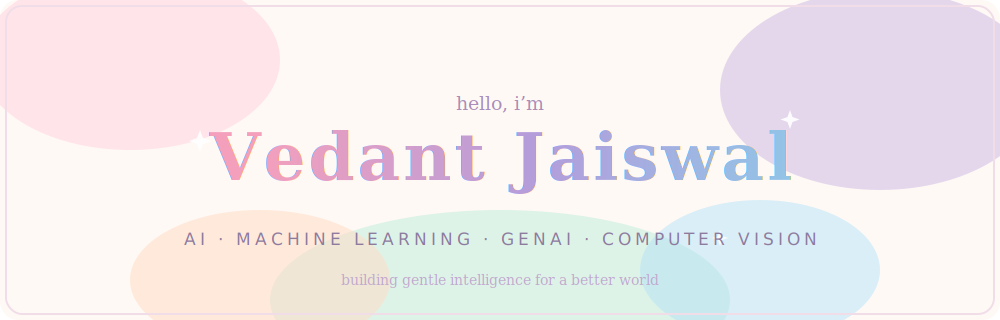
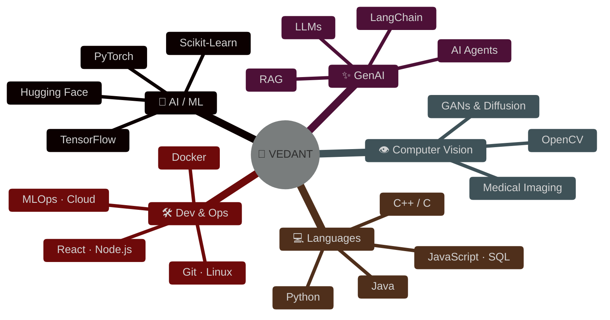

<!-- ╔══════════════════════════════════════════════════════════════════╗
     ║   CUSTOM HAND-CRAFTED ANIMATED HERO — one of a kind ✦             ║
     ╚══════════════════════════════════════════════════════════════════╝ -->
<p align="center">
  
</p>

<!-- ── TYPING ── -->
<p align="center">
  
</p>

<!-- ── SOCIALS ── -->
<p align="center">
  <a href="https://www.linkedin.com/in/vedjais/">
    
  </a>
  <a href="https://www.kaggle.com/vedantjaiswal001">
    
  </a>
  <a href="mailto:jaiswalvedant2004@gmail.com">
    
  </a>
  <a href="https://www.instagram.com/i_m_vedant_001/">
    
  </a>
</p>

<p align="center">
  
  
</p>

<p align="center"></p>

<!-- ╔══════════════════════════════════════════════════════════════════╗
     ║   TERMINAL PROFILE                                                ║
     ╚══════════════════════════════════════════════════════════════════╝ -->
<h2 align="center">⬢ &nbsp;S Y S T E M &nbsp;·&nbsp; P R O F I L E&nbsp; ⬢</h2>

```text
vedant@lnmiit:~$ neofetch

  vedant@github
  --------------------------------------------------
  OS        : Human v21 (Jaipur, IN)
  Host      : LNMIIT - B.Tech Computer Science
  Kernel    : Curiosity 24/7
  Shell     : Python + PyTorch
  Focus     : GenAI | LLMs | Computer Vision | Agents
  Research  : AI Threat Modeling
              Brain Tumor MRI Generation
              Audio Deepfake Detection
  Learning  : RAG | MLOps | Cloud | Scalable AI
  Uptime    : Always learning
  Audio     : lo-fi (debugging mode)
  Mission   : "Ship AI that actually helps people."

vedant@lnmiit:~$ _
```

<p align="center"></p>

<!-- ╔══════════════════════════════════════════════════════════════════╗
     ║   TECH UNIVERSE — native Mermaid mind-map                         ║
     ╚══════════════════════════════════════════════════════════════════╝ -->
<h2 align="center">⬢ &nbsp;T E C H &nbsp;·&nbsp; U N I V E R S E&nbsp; ⬢</h2>



<br>

<p align="center">
  
</p>

<p align="center"></p>

<!-- ╔══════════════════════════════════════════════════════════════════╗
     ║   MISSION CONTROL                                                 ║
     ╚══════════════════════════════════════════════════════════════════╝ -->
<h2 align="center">⬢ &nbsp;M I S S I O N &nbsp;·&nbsp; C O N T R O L&nbsp; ⬢</h2>

<div align="center">

| STATUS | MISSION | PAYLOAD | PROGRESS |
|:------:|---------|---------|:---------|
| 🟣 | **AI Threat Modeling** | Securing AI against adversarial attacks | `▰▰▰▰▰▰▱▱▱▱` |
| 🟣 | **Brain Tumor MRI Generation** | GANs & Diffusion for medical imaging | `▰▰▰▰▰▰▰▱▱▱` |
| 🟣 | **Audio Deepfake Detection** | Fighting synthetic media with DL | `▰▰▰▰▰▱▱▱▱▱` |
| 🔵 | **AI Agents** | Autonomous systems that reason & act | `▰▰▰▰▰▰▱▱▱▱` |
| 🔵 | **Generative AI Apps** | LLM-powered applications | `▰▰▰▰▰▰▰▰▱▱` |
| 🔵 | **Open Source** | Giving back to the community | `▰▰▰▰▱▱▱▱▱▱` |
| 🟢 | **DSA Grind** | Sharpening fundamentals daily | `▰▰▰▰▰▰▰▱▱▱` |

<sub>🟣 research &nbsp;·&nbsp; 🔵 building &nbsp;·&nbsp; 🟢 daily ritual — bars update as missions progress</sub>

</div>

<p align="center"></p>

<!-- ╔══════════════════════════════════════════════════════════════════╗
     ║   TELEMETRY                                                       ║
     ╚══════════════════════════════════════════════════════════════════╝ -->
<h2 align="center">⬢ &nbsp;T E L E M E T R Y&nbsp; ⬢</h2>

<p align="center">
  
</p>

<p align="center">
  
</p>

<!-- ── THE SNAKE ── -->
<p align="center">
  
</p>

<p align="center"></p>

<!-- ╔══════════════════════════════════════════════════════════════════╗
     ║   OUTRO                                                           ║
     ╚══════════════════════════════════════════════════════════════════╝ -->
<h2 align="center">⬢ &nbsp;T R A N S M I S S I O N &nbsp;·&nbsp; E N D&nbsp; ⬢</h2>

```text
vedant@lnmiit:~$ echo $MISSION
"Building intelligent systems with AI, one project at a time."

vedant@lnmiit:~$ ./collaborate --with you
> Connection request sent. Awaiting handshake...
```

<p align="center">
  <a href="https://www.linkedin.com/in/vedjais/">
    
  </a>
</p>

<p align="center">
  ⭐ <b>Star a repo if something caught your eye — it fuels the mission.</b> ⭐
</p>

<p align="center">
  
</p>
