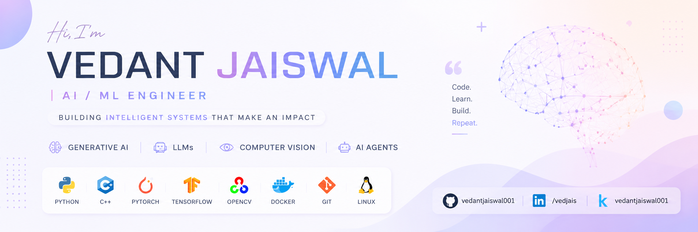

  

 

# 👋 Hi, I'm Vedant Jaiswal

### Building AI that solves real-world problems

**AI • Machine Learning • Generative AI • LLMs • Computer Vision**

 

 
 

<h2 align="center"> About Me</h2>

 **B.Tech Computer Science Student** @ **The LNM Institute of Information Technology (LNMIIT)**

 Passionate about **Artificial Intelligence, Machine Learning & Deep Learning**

 Exploring **Generative AI, LLMs, Computer Vision & AI Agents**

 Building AI-powered applications, research projects and intelligent systems

 Currently learning **RAG, MLOps, Cloud & Scalable AI Systems**

 Passionate about solving real-world problems through AI.

 

 
 

<h2 align="center"> Current Focus</h2>

|  Research |  Building |
|:-----------:|:-----------:|
| AI Threat Modeling | AI Agents |
| Brain Tumor MRI Generation | Generative AI |
| Audio Deepfake Detection | Open Source |
| Computer Vision | DSA & Problem Solving |

 
 

<h2 align="center"> Tech Stack</h2>

 

###  Favorite Technologies

**Python** • **PyTorch** • **TensorFlow** • **LLMs** • **Generative AI**

 

> *"Building intelligent systems with AI, one project at a time."*

 
 

<h2 align="center"> GitHub Analytics</h2>

 

 
 

---

 

### ⭐ Thanks for visiting!

*"Building AI that solves real-world problems through innovation and continuous learning."*

